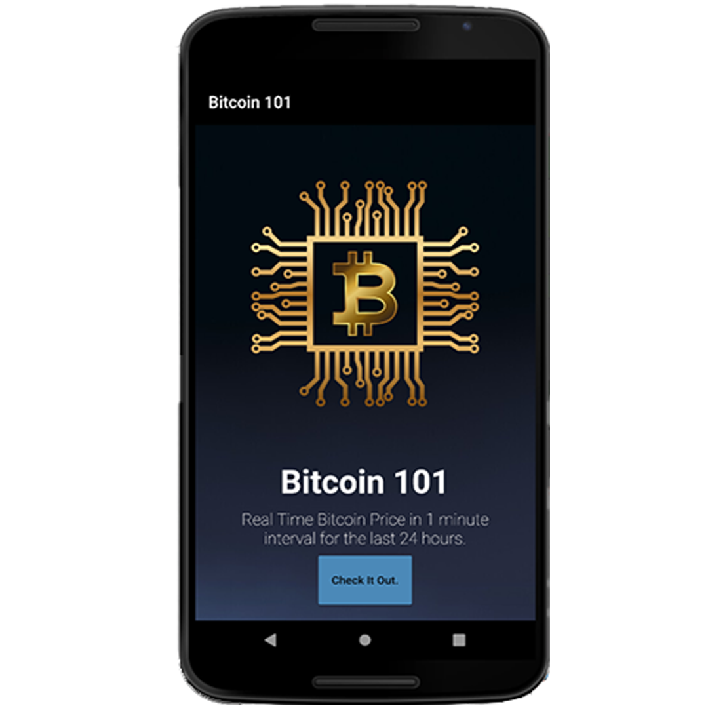
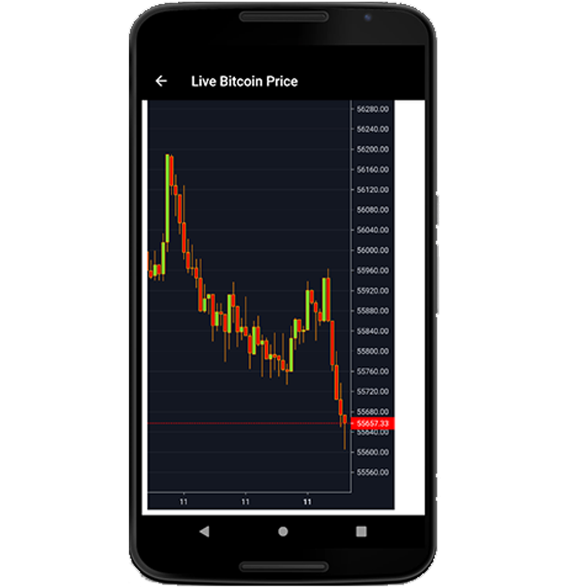

<h1 align="center">Bitcoin 101</h1>

  
  

# Details

<h3 align="center">Basically this project is divided into two parts.</h3>

•  Bitcoin Price Live Chart – In this, the Binance Crypto API, a streaming data API, is connected to a JavaScript websocket, which then gives the data to Light Weighted Trading View Candlestick Chart. Afterwards, the live chart is implemented to a Flask framework, which is then containerized by Docker and deployed through Azure.  

Link of deployment - https://bitcoinpricelivechart.azurewebsites.net/ 

• Flutter App – A basic Flutter app, in which the user sees an interactive front page. On the front page the user can find a button, which when clicked, renders in a webview page the Bitcoin Price Live chart which is deployed on Azure. 

By this the user gets the live price change of Bitcoin Crypto Currency on their cell phone by just clicking a single button.
